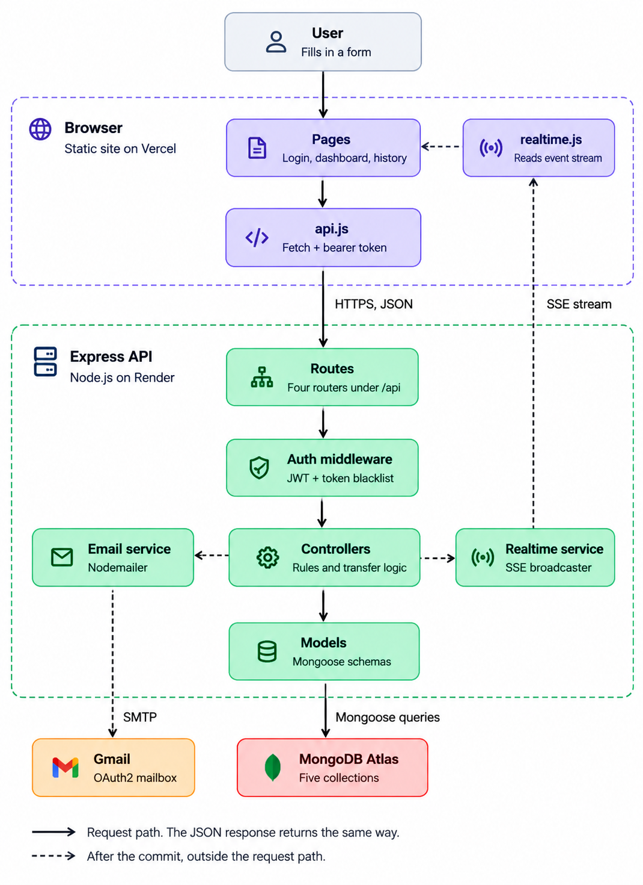

# Architecture

How Vault Ledger is put together, and what happens step by step when someone sends money.

## System diagram



- **Solid arrows** are the request path. The JSON response travels back the same way.
- **Dashed arrows** happen after the database commit, outside the request path: the live-update event and the confirmation email.

## The three parts

### 1. Browser (static site on Vercel)

Plain HTML, CSS and JavaScript in `client/`, with no build step.

| Piece | File | Job |
|---|---|---|
| Pages | `client/pages/*.html` | Login, register, dashboard, history and privacy screens |
| API client | `client/js/api.js` | Sends every request with `fetch`, attaching the login token as `Authorization: Bearer <JWT>` |
| Live updates | `client/js/realtime.js` | Keeps one event stream open and tells the page to reload when money moves |

The login token is kept in `localStorage`. `client/js/config.js` decides which backend to call: `localhost:3000` during development, the Render URL otherwise.

### 2. Express API (Node.js on Render)

Code in `src/`. A request passes through these layers in order:

| Layer | Location | Job |
|---|---|---|
| Routes | `src/app.js`, `src/routes/` | Four routers under `/api`: `auth`, `accounts`, `transactions`, `events` |
| Auth middleware | `src/middlewares/auth.middleware.js` | Checks the JWT and the token blacklist, then attaches the user to the request |
| Controllers | `src/controllers/` | The rules: who can do what, and the transfer logic |
| Models | `src/models/` | Mongoose schemas for the five collections |

Two services sit beside the controllers and run after a transfer commits:

| Service | File | Job |
|---|---|---|
| Realtime service | `src/services/realtime.service.js` | Holds open event streams and pushes an event to the sender and recipient |
| Email service | `src/services/email.service.js` | Sends confirmation emails through Gmail (Nodemailer, OAuth2) |

### 3. External services

| Service | Used for |
|---|---|
| MongoDB Atlas | All data. It runs as a replica set, which MongoDB transactions require |
| Gmail | Registration and transfer confirmation emails. Optional: if email fails, the app keeps working |

## Data model

Five collections in MongoDB:

| Collection | Holds | Notes |
|---|---|---|
| `users` | Name, email, hashed password | `system: true` marks the Treasury user |
| `accounts` | Owner, status (`ACTIVE`, `FROZEN`, `CLOSED`), currency | **No balance field.** `lockVersion` is a counter used to make transfers take turns, not money |
| `transactions` | From, to, amount, status, `idempotencyKey` | The key is unique, so the same transfer can't be saved twice |
| `ledgers` | One `DEBIT` or `CREDIT` entry per account per transfer | Can't be edited or deleted. Balances are calculated by adding these up |
| `tokenblacklists` | Tokens revoked by logout | Deleted automatically after 3 days, when the token would have expired anyway |

Every transfer creates **one transaction and two ledger entries**: money out of one account and money into the other. An account's balance is always its credits minus its debits.

## Workflow: sending money, from input to output

### 1. User input
On the dashboard, the user enters the recipient's account ID and an amount, then clicks **Send**. The page checks the amount against the balance on screen and creates a fresh `idempotencyKey` for this attempt.

### 2. `api.js` sends the request
`POST /api/transactions` with this JSON body, plus `Authorization: Bearer <JWT>`:

```json
{
  "fromAccount": "<sender's account ID>",
  "toAccount": "<recipient's account ID>",
  "amount": 200,
  "idempotencyKey": "<random UUID>"
}
```

### 3. Routes
`app.js` runs `cors`, `express.json` and `cookieParser`, then hands the request to the transaction router.

### 4. Auth middleware
It reads the token and rejects it with **401** if it's in the blacklist. Otherwise it verifies the JWT signature, loads the user and attaches it as `req.user`.

### 5. Controller checks
`createTransaction` rejects the request unless:

- the amount is a positive number;
- `fromAccount` belongs to the logged-in user, and `toAccount` exists;
- the `idempotencyKey` is new. A repeat returns the earlier result instead of paying twice;
- both accounts are `ACTIVE`.

### 6. One MongoDB transaction
Either all of these are saved, or none are:

1. **Lock the sender.** Increase `lockVersion` on the sender's account. Two transfers from the same account both write this document, so MongoDB stops one with a write conflict and retries it once the other finishes. This stops two transfers from spending the same money.
2. **Check the balance.** Add up the sender's ledger entries. If the balance is too low, cancel everything and return **400**.
3. **Record the transfer.** Insert the transaction as `PENDING`.
4. **Move the money.** Insert one `DEBIT` entry for the sender and one `CREDIT` entry for the recipient.
5. **Finish.** Mark the transaction `COMPLETED` and commit.

### 7. Live update
Right after the commit, the realtime service pushes a `transaction` event over the open `GET /api/events` stream to the sender and the recipient only. In the browser, `realtime.js` receives it, the page reloads its balance and history, and the recipient sees a "Received ₹X from Name" message.

### 8. Response
The API returns **201** with the transaction. It travels back up the same path, and the sender's page shows a success message.

### 9. Email
After the response is sent, the email service emails the sender a confirmation through Gmail. If the email fails, the transfer still stands.

## Other flows in brief

| Flow | What happens |
|---|---|
| **Register / log in** | The password is hashed with bcrypt. The API returns a JWT that lasts 3 days, which the browser stores |
| **Log out** | The token is added to the blacklist and its live-update stream is closed, so it can't be used again |
| **Issue funds (Treasury)** | `POST /api/transactions/system/initial-funds`. Same transaction steps as a transfer, but without the balance check: the Treasury account goes negative by exactly the amount of money in the system |
| **History** | `GET /api/transactions` pages through results newest-first using a cursor. `GET /api/transactions/summary` returns monthly sent and received totals in the user's timezone |
| **Live connection** | Each open dashboard or history page holds one `GET /api/events` stream. The server pings it every 25 seconds to keep it open, and the browser reconnects and catches up if it drops |

## Deployment

| Part | Platform | Notes |
|---|---|---|
| Frontend | Vercel | Serves `client/` as static files |
| API | Render | Runs `npm start`. The free tier sleeps when idle, so the first request after a pause can take 30 to 60 seconds |
| Database | MongoDB Atlas | Network Access must allow `0.0.0.0/0`, because Render has no fixed IP address |

Open event streams are held in the API server's memory. That works for one server instance, which is what Render's free tier runs. Several instances would need a shared channel such as Redis so every instance can reach every user's stream.
